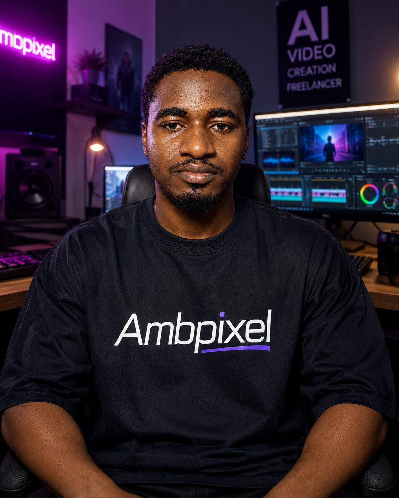

# Ambpixel

**Live site:** [https://ambpixel.vercel.app/](https://ambpixel.vercel.app/)



Cinematic AI creative studio portfolio: hero video, about, skills, portfolio grid, testimonials, and contact. Built with **Next.js**, **Tailwind CSS**, and **Framer Motion**.

## Stack

- [Next.js](https://nextjs.org/) (App Router)
- [Tailwind CSS](https://tailwindcss.com/)
- [Framer Motion](https://www.framer.com/motion/)

## Local development

```bash
npm install
npm run dev
```

Open [http://localhost:3000](http://localhost:3000).

## Media assets

Add your own files under `public/`:

| Path | Purpose |
|------|---------|
| `public/videos/hero.mp4` | Hero background |
| `public/videos/<category>/sample.mp4` | Portfolio tiles (e.g. `ugc-videos`, `fintech-commercials`) |
| `public/images/founder/founder.jpg` | Founder image (hero + branding) |

## Deploy

The live deployment is on [Vercel](https://vercel.com/) at [https://ambpixel.vercel.app/](https://ambpixel.vercel.app/). Connect this repo in the Vercel dashboard to redeploy on push.

## License

[MIT](LICENSE) — see `LICENSE` for full text.
